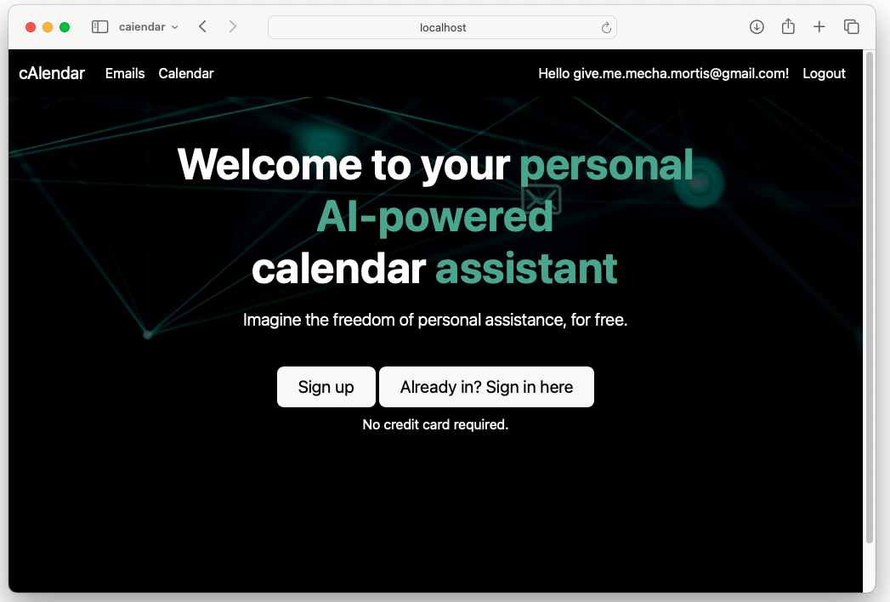
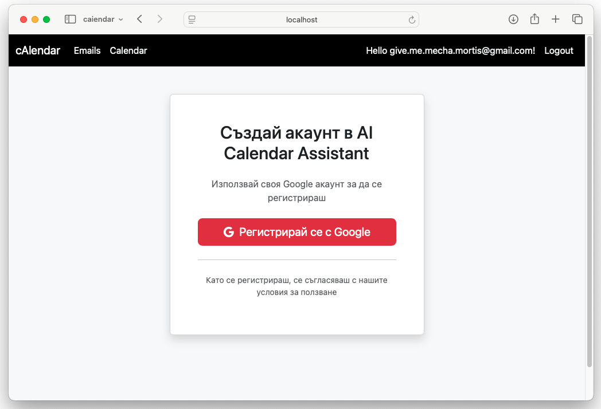
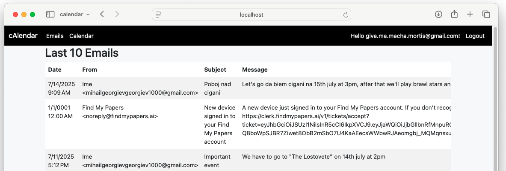
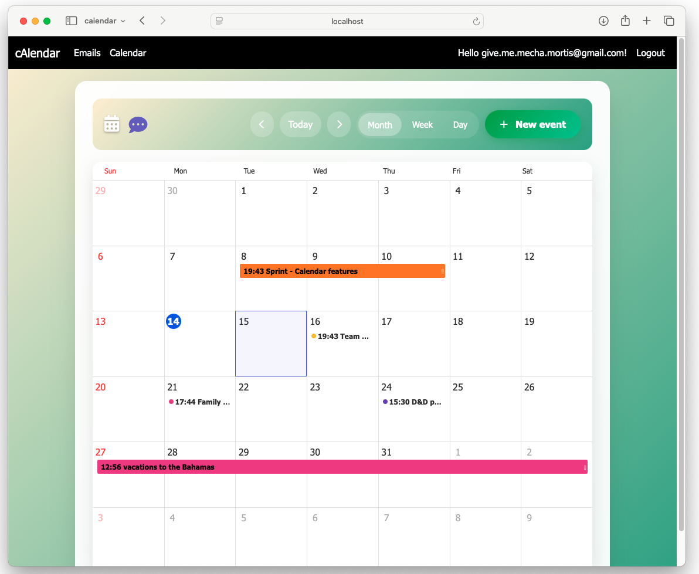
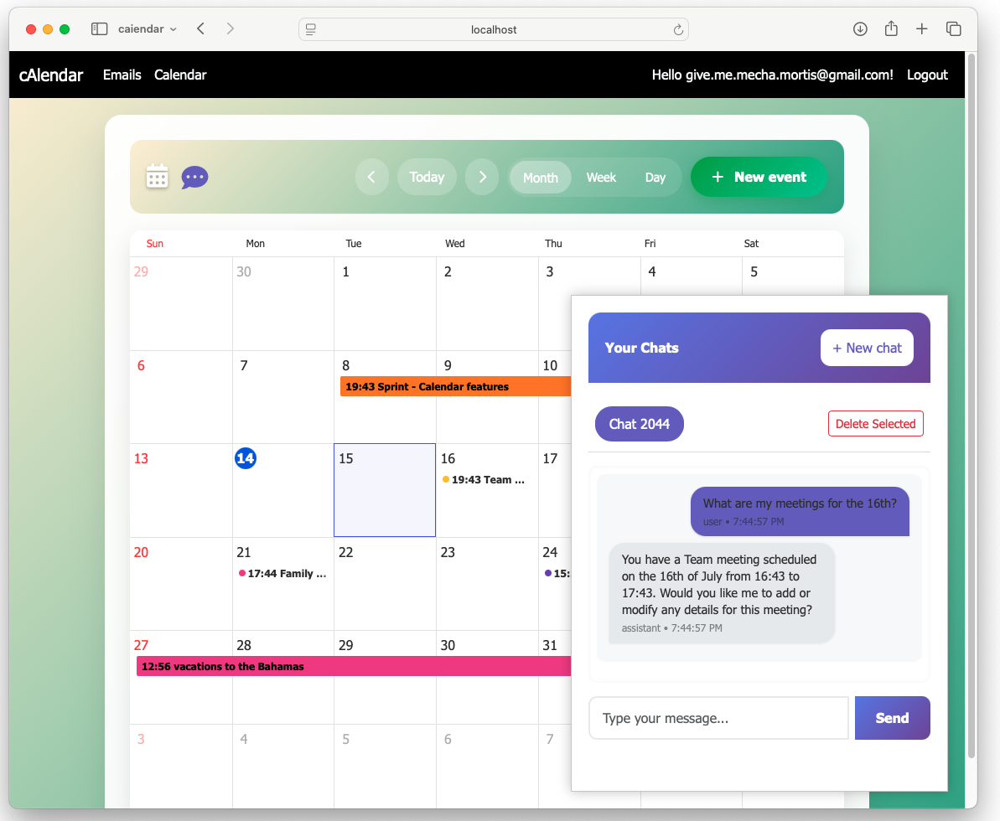
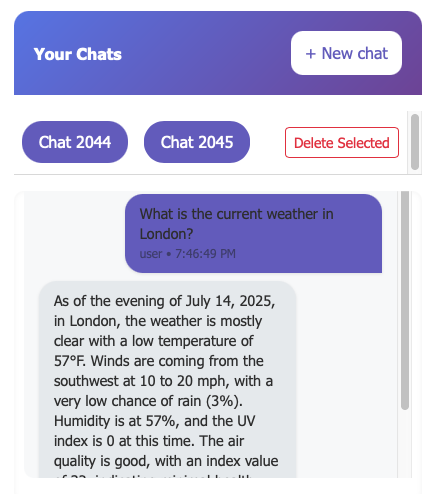
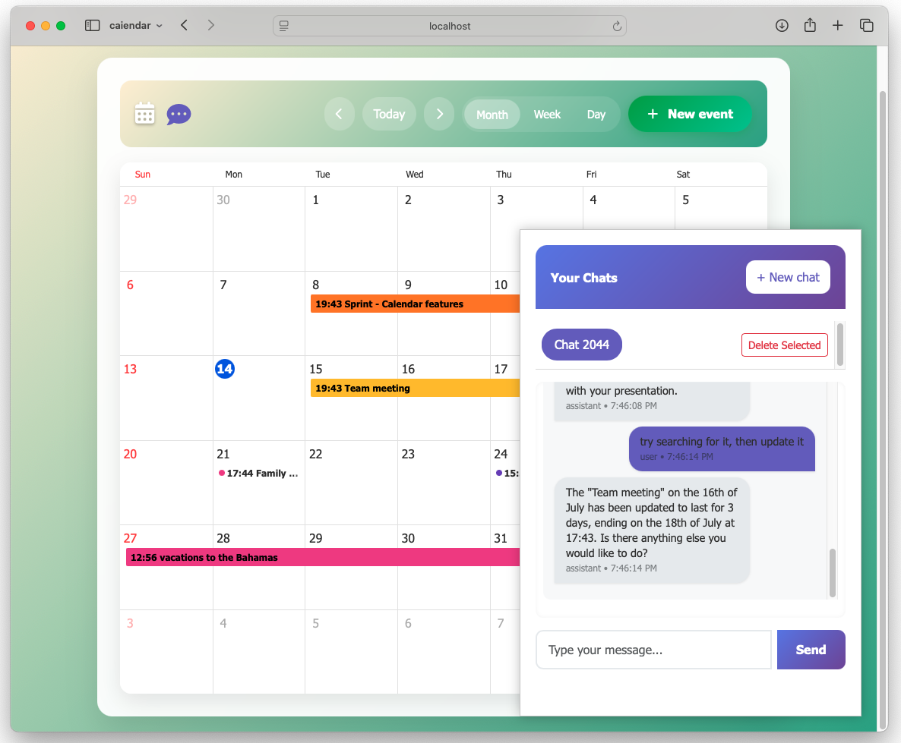

# cAIendar

cAIendar is an AI-powered organiser built with ASP.NET Core. By linking your Gmail and Google Calendar, the assistant uses IBM Watsonx (with optional Ollama fallback) to automatically summarise emails, extract tasks, create events and draft responses. Everything ends up in one place so you can make **informed decisions** about your schedule.

**Key capabilities**

- **Informed decisions** – surfaces clashes and suggests optimal times.
- **Personal LLM** – chat with a private model that knows your schedule.
- **Automatic email generation** – drafts replies and invitations.
- **Task extraction** – turns messages into actionable to‑dos.
- **Unified calendar** – view events, tasks and notes together.

<p align="center"></p>

## Features

- **Google OAuth Login** – users sign in with their Google account so the app can read and reply to Gmail messages.  
  
- **Email Processing** – incoming emails are scanned and summarised by the LLM. Meetings or tasks described in emails are automatically created in your calendar.  
  
- **Calendar & Tasks** – see your agenda in a month, week or day view. Events and tasks are stored in SQL Server via Entity Framework Core.  
  
- **Chat with the LLM** – a chat sidebar allows you to instruct the assistant to create, edit or cancel events. The AI can reason over clashes, search the web and fetch the latest information if needed.  
  
- **Internet Search** – the assistant can call the `internet_search` tool which uses Google Custom Search and scrapes the first result before summarising it.  
  
- **Modify existing events** – commands like "move my meeting to tomorrow" trigger the assistant to call the appropriate APIs.  
  

## Repository Layout

```
AiCalendarAssistant/       ASP.NET Core web application
AiCalendarAssistant.Data/  Entity Framework models, migrations and seeders
Dockerfile, docker-compose.yml
images/                    Screenshots used in this README
```

The main project uses `PromptRouter` and `ChatMessenger` to talk to IBM Watsonx or Ollama. Service classes handle Gmail integration, event management and AI-powered email replies.

## Running locally

Requirements:

- [.NET 8 SDK](https://dotnet.microsoft.com/download)
- SQL Server (or use the provided docker-compose setup)

```bash
# build and run
cd AiCalendarAssistant
dotnet ef database update   # set up the local database
dotnet run
```

Alternatively you can run the entire stack with Docker:

```bash
docker compose up --build
```

The app will be available on `https://localhost:7194`.

## Environment variables

Create a `.env` file in `AiCalendarAssistant` with your Google OAuth credentials and LLM settings. You can use `exampleEnv.txt` as a starting point.

```
Authentication__Google__ClientId=your-client-id
Authentication__Google__ClientSecret=your-client-secret
Llm__Url=...
Llm__ProjectId=...
Llm__ModelId=...
Llm__ApiKey=...
```

## License

This project is provided as-is for demonstration purposes.


# Documentation


                          AiCalendarAssistant Project Documentation
================================================================================

Project Name:     AiCalendarAssistant (cAIendar)
Maintained by:    Internal Development Team
Last Updated:     July 14, 2025

--------------------------------------------------------------------------------
1. Overview
--------------------------------------------------------------------------------

AiCalendarAssistant (also branded as "cAIendar") is an AI-powered personal
organizer web application developed using ASP.NET Core. It integrates with 
Google APIs (Gmail, Calendar) and leverages IBM Watsonx or Ollama LLMs to
automate daily planning tasks, including email summarization, task extraction,
calendar event creation, and email drafting.

The goal is to enhance productivity and decision-making by unifying tasks,
messages, and events in a centralized, intelligent assistant.

--------------------------------------------------------------------------------
2. Solution Structure
--------------------------------------------------------------------------------

The solution consists of two projects:

1. AiCalendarAssistant (ASP.NET Core Web Application)
2. AiCalendarAssistant.Data (Data Access Layer with EF Core)

Directory breakdown:

- Controllers/          → Web endpoints (MVC controllers)
- Views/                → Razor views (UI rendering)
- Models/               → ViewModels & domain objects
- Services/             → Business logic (email, LLM, calendar)
- Llm/                  → Language Model integration (Watsonx, Ollama)
- Infrastructure/       → Middleware, auth policies, helpers
- Config/               → Static app config classes (API keys, etc.)
- Utilities/            → Utility methods and helpers
- Areas/                → Modular UI areas (admin/user split if applicable)
- wwwroot/              → Static assets
- Program.cs / Program2.cs → App initialization
- .env / appsettings.json   → Environment & runtime configuration

--------------------------------------------------------------------------------
3. Core Technologies
--------------------------------------------------------------------------------

- .NET 8 / ASP.NET Core MVC
- Entity Framework Core (SQL Server)
- IBM Watsonx + Ollama (LLM Integration)
- Google OAuth 2.0 (Gmail/Calendar access)
- Docker for containerized deployment
- Razor Pages & Bootstrap for frontend UI

--------------------------------------------------------------------------------
4. Features Summary
--------------------------------------------------------------------------------

- Google OAuth Login for account connection
- Gmail access and email summarization via LLMs
- Task and intent extraction from messages
- Event creation and calendar sync
- Email response drafting using AI
- Personal LLM chat based on schedule context
- Real-time update suggestions and schedule insights

--------------------------------------------------------------------------------
5. Configuration & Environment Setup
--------------------------------------------------------------------------------

Required environment variables (in `.env`):

- ConnectionString=<SQLServerConnection>
- GoogleClientId, GoogleClientSecret
- WatsonxCredentials or OllamaFallback
- GmailApiKey, GmailSecret

The application loads `.env` at startup via `DotNetEnv`.

--------------------------------------------------------------------------------
6. App Startup Logic (Program.cs)
--------------------------------------------------------------------------------

- Loads environment variables
- Configures EF Core with ApplicationDbContext
- Adds Identity (ApplicationUser)
- Registers services: EmailService, LlmService, SchedulerService, etc.
- Configures Google Authentication and session cookies
- Starts middleware pipeline and routes

--------------------------------------------------------------------------------
7. Logging & Diagnostics
--------------------------------------------------------------------------------

Configured via `appsettings.json`:

```
"Logging": {
  "LogLevel": {
    "Default": "Information",
    "Microsoft.AspNetCore": "Warning"
  }
}
```

Application emits logs per feature area. Errors are routed to a centralized
exception handler (TBD: LoggingService or ErrorController).

--------------------------------------------------------------------------------
8. Development & Deployment
--------------------------------------------------------------------------------

### Local Dev Setup:
1. Clone the repo
2. Set up `.env` and `appsettings.Development.json`
3. Run EF Core migrations:
   > dotnet ef database update
4. Launch the app:
   > dotnet run

### Docker Deployment:
- Dockerfile and docker-compose.yml included
- Run with:
  > docker-compose up --build

--------------------------------------------------------------------------------
9. Next Steps
--------------------------------------------------------------------------------

[ ] Document each Controller endpoint
[ ] Include Swagger/OpenAPI support
[ ] Integrate OAuth scopes config for Gmail and Calendar
[ ] Secure token storage (Google tokens)
[ ] LLM usage monitoring

--------------------------------------------------------------------------------
Author: ChatGPT (Generated on behalf of the AiCalendarAssistant Dev Team)
================================================================================

